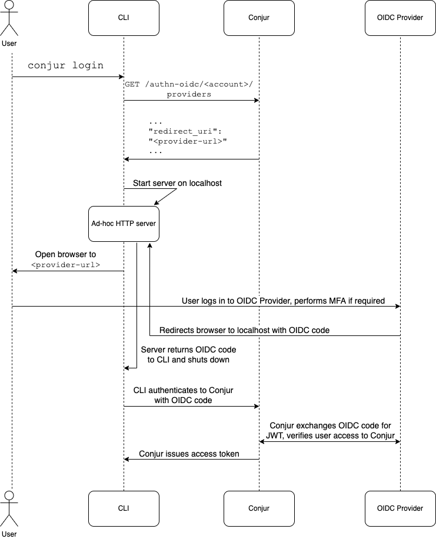

# Authn-OIDC/MFA Support in Conjur CLI

## Useful Links

| Link | Private |
|------|:-------:|
| [Conjur Docs: OIDC Authenticator for Conjur UI and Conjur CLI authentication](https://docs.conjur.org/Latest/en/Content/OIDC/OIDC-for-UI-and-CLI.htm) | No |
| [Conjur Docs: OIDC Authenticator REST API](https://docs.conjur.org/Latest/en/Content/Developer/Conjur_API_OIDC_Authenticator.htm#OIDCAuthenticatorforConjurUIorCLIauthentication) | No |
| Confluence: MFA for Conjur UI - Architecture | Yes |
| Confluence: MFA Customer Documentation Changes - Dev Content | Yes |

## Overview

Conjur supports various forms of authentication, including OIDC (OpenID Connect). OIDC is unique in that requires the user to
navigate to a third party website (SSO provider) and authenticate there, often using MFA. The user then receives a token from
the SSO provider and passes this to Conjur, which verifies that the token is signed correctly by the trust SSO provider.
This document describes the design and implementation of the OIDC authentication support in the Conjur CLI.

## User Experience

The `conjur init` command supports OIDC authentication as an authentication type. A user can specify
the authentication type `oidc` using the `-t` or `--authn-type` option.
When using `oidc`, a `--service-id` option is mandatory.

| Option | Acceptable Values | Default | Description |
| ------ | ----------------- | ------- | ----------- |
| `--authn-type` / `-t` | `authn`, `ldap`, `oidc` | `authn` | The authentication method to use when connecting to Conjur |
| `--service-id` | `<service_id>` | N/A | The service_id of the OIDC service to use |

The `conjur login` command will open a browser to the OIDC URL configured for the SSO provider.
The user must then authenticate to the SSO provider and receive a code which will be passed to Conjur which will in turn
exchange it for a JWT and issue a Conjur access token which will be stored in the user's keystore or in the .netrc file.
(See [below](#in-the-api-repository) for how the CLI retrieves the code from the browser.)

## Limitations

Because the OIDC authentication flow requires the user to authenticate in a browser, the CLI cannot be used in a headless
environment (such as a Docker container) with OIDC authentication.

## Flow Diagram

